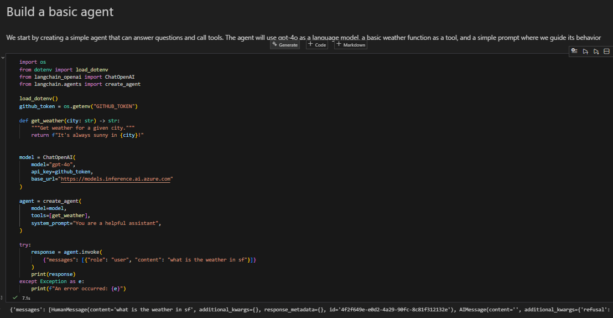
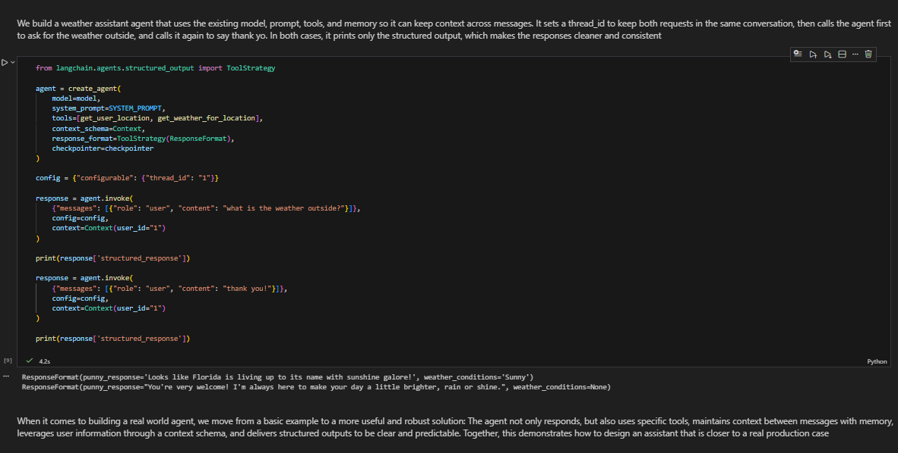

# Basic-LangChain-LLM

## Name: David Santiago Castro

This repository contains a single Jupyter Notebook Basic-LangChain-LLM.ipynb that follows the LangChain Quickstart approach to build a basic LLM-powered agent. It demonstrates: setting up LangChain with environment variables,  creating a simple agent that can call a custom weather tool, and  upgrading to a more real-world agent with a system prompt, multiple tools, structured outputs, and in-memory checkpointing

## Getting Started

These instructions will get you a copy of the project up and running on your local machine for development and testing purposes. See deployment for notes on how to deploy this on a live system.

### Prerequisites

What things you need to install the software and how to install them

- **Python 3.10+** 
- **pip** 
- **Git**
- **Jupyter** - VS Code notebooks or Jupyter Lab/Notebook
- **An API key compatible with ChatOpenAI**
  - This notebook is configured to read GITHUB_TOKEN from a .env file and uses:
    - base_url="https://models.inference.ai.azure.com"
  - If you want to use OpenAI directly, you can adapt the notebook to use OPENAI_API_KEY 

Give examples

Check Python:
```bash
python --version
````

(Optional) Install Jupyter:

```bash
pip install -U jupyter
```

### Installing

A step by step series of examples that tell you how to get a development env running

Say what the step will be

1. **Clone the repository**

```bash
git clone https://github.com/daviidc29/Basic-LangChain-LLM
cd Basic-LangChain-LLM
```

2. **Create and activate a virtual environment**

```bash
python -m venv .venv
```

* Windows (PowerShell):

```bash
.\.venv\Scripts\Activate.ps1
```

* macOS/Linux:

```bash
source .venv/bin/activate
```

3. **Install dependencies**
   Give the example

The notebook installs:

* `langchain-openai`
* `python-dotenv`

To ensure everything used in the notebook works, install:

```bash
pip install -U langchain langchain-openai langgraph python-dotenv
```

4. **Create a .env file with your API token**
   And repeat

Create a file named .env in the repository root:

```env
GITHUB_TOKEN=YOUR_TOKEN_HERE
```

> Note: The notebook loads this with `load_dotenv()` and reads it via `os.getenv("GITHUB_TOKEN")`.

**If you prefer OpenAI instead of GitHub/Azure-compatible endpoint**

* Replace GITHUB_TOKEN with OPENAI_API_KEY in the notebook
* Remove the base_url argument 
* Then set:

```env
OPENAI_API_KEY=YOUR_OPENAI_KEY_HERE
```

5. **Run the notebook**
   until finished

Option A (VS Code):

* Open Basic-LangChain-LLM.ipynb
* Select your `.venv` kernel
* Run cells top-to-bottom

Option B (Jupyter Lab):

```bash
jupyter lab
```

Then open Basic-LangChain-LLM.ipynb and run all cells.

Basic agent:



Real-world agent:



Expected behavior (high level):

* The agent will either call get_weather_for_location(city) directly when the city is known,
* or call get_user_location(...) first to infer the user’s city, then return a punny weather response using the defined ResponseFormat

## Running the tests

There are **no automated tests included** in this repository because it is a single notebook-based lab. Validation is done by executing the notebook cells and confirming the agent responses.

## Built With

* **Python** - Programming language
* **LangChain** - Agent framework and orchestration
* **langchain-openai** - ChatOpenAI integration
* **LangGraph** - In-memory checkpointing (InMemorySaver)
* **python-dotenv** - Environment variable loading for local development
* **Jupyter Notebook** - Execution environment

## Contributing

Please read CONTRIBUTING.md for details on our code of conduct, and the process for submitting pull requests to us.

(If `CONTRIBUTING.md` is not present yet, you can contribute by opening an issue describing the change, then submitting a PR.)

## Authors

David Santiago Castro - Initial work

See also the list of contributors who participated in this project.

## License

This project is licensed under the MIT License - see the LICENSE.md file for details

## Acknowledgments

* LangChain documentation and tutorials (Quickstart)
* OpenAI-compatible chat model interface used via `ChatOpenAI`
* Hat tip to anyone whose code was used
* Inspiration
  etc
